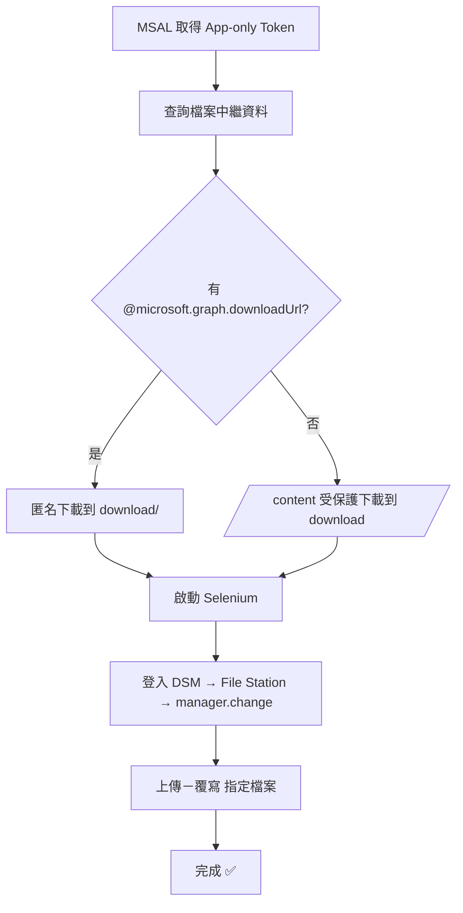

# 🚀 TAITRA RPA  
>Graph 下載 + Synology DSM 上傳 — 以 MSAL 取得 App-only Token 自動下載檔案，並由 Selenium 登入 DSM 的 File Station（manager.change）執行上傳覆寫；所有祕密以 .env 管理，模組化設計可排程無人值守。**

[](https://www.python.org/)
[](https://www.selenium.dev/)
[](https://learn.microsoft.com/azure/active-directory/develop/)
[](#)


## ✨ 主要功能
- 📥 **Graph 檔案下載**：App-only（Client Credentials）流程，支援匿名下載連結或 `/content` 保護端點
- 📤 **DSM 自動上傳**：自動登入、進入 File Station、點「上傳－覆寫」並提交檔案路徑
- 🧩 **模組化**：`automation/graph_client.py`（下載）、`automation/dsm_uploader.py`（上傳）
- 🔐 **祕密管理**：`.env` / `.env.example`，避免把密碼推上 GitHub


## 🗂 專案結構
```
project/
├─ automation/
│  ├─ __init__.py
│  ├─ graph_client.py        # 取得 Token、呼叫 Graph、下載檔案
│  └─ dsm_uploader.py        # Selenium 登入 DSM、上傳覆寫
├─ download/                 # 下載結果（已被 .gitignore 忽略）
├─ .env                      # 祕密（勿上傳）
├─ .env.example              # .env 樣板（可上傳）
├─ .gitignore
├─ config.py                 # 統一讀取設定（只讀環境變數）
└─ main.py                   # 串流程：下載 → 上傳
```

---

## ⚙️ 快速開始
```bash
# 建立/啟用虛擬環境（Windows PowerShell）
python -m venv .venv
Set-ExecutionPolicy -Scope Process Bypass
.\.venv\Scripts\Activate.ps1

# 安裝套件
pip install msal requests selenium webdriver-manager python-dotenv
```


## 🔐 建立 .env（不要上傳到 Git）
```dotenv
TENANT_ID=
CLIENT_ID=
CLIENT_SECRET=

DRIVE_ID=
FILE_ID=

DSM_URL=http://<NAS>:5000/
DSM_USERNAME=
DSM_PASSWORD=
```
> 提示：`.env.example` 可上傳，請保留空值給使用者自行填寫。


## ▶️ 執行
```bash
python main.py
```
流程：**Graph 下載 → 存到 `download/` → Selenium 登入 DSM → 上傳（覆寫）**。


## 🧭 工作流程（Mermaid）



## 🧹 故障排除（FAQ）
- 🔑 **`invalid_client (AADSTS7000215)`**：你填了 Secret **ID**，請改填 Secret **Value**。
- 🚫 **Graph 403**：權限不足，請為應用核准 Application Permissions（如 `Sites.Read.All` / `Files.ReadWrite.All`）。
- 🔍 **Selenium 找不到元素**：確認使用 `presence_of_element_located`，並適度拉長等待秒數。
- 🔐 **GitHub 推不上去（GH013）**：歷史含祕密 → 移除密碼檔並重置 Git 歷史，並旋轉（重建）外洩金鑰。


## 🔒 安全建議
- `.env`、`download/`、`.venv/`、`__pycache__/` **一定要在 `.gitignore`**
- `config.py` **不**要預設任何祕密值，只讀環境變數
- 若曾把金鑰推上遠端：**撤銷/重建** 金鑰 + **清 Git 歷史**


## 🗺 後續規劃
- 直接改用 Graph 上傳（取代部分 Selenium）
- 重試/超時與更完整的日誌
- 撰寫 CI 與排程（Task Scheduler / GitHub Actions）
